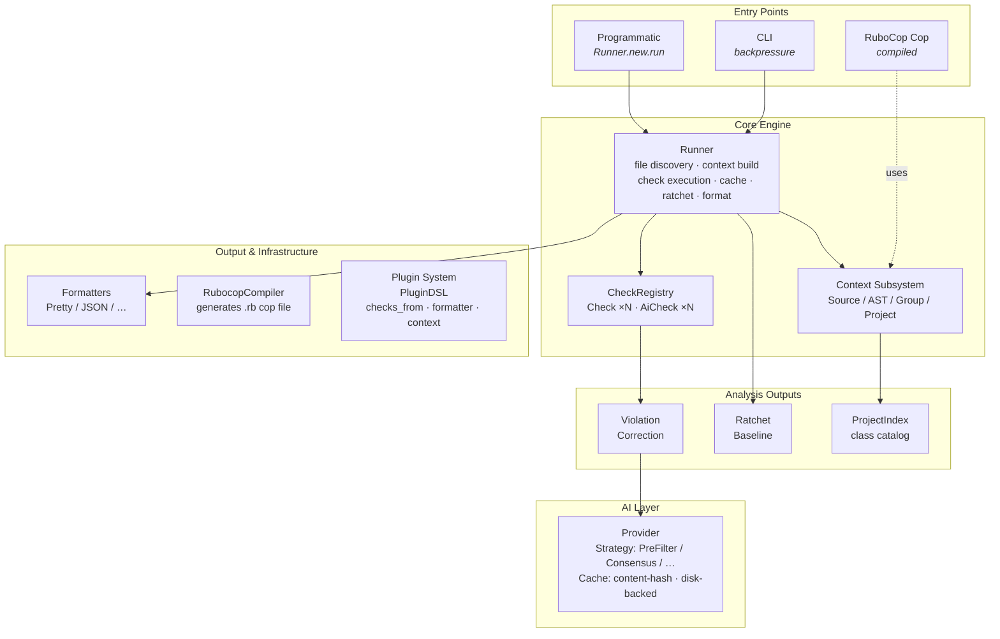
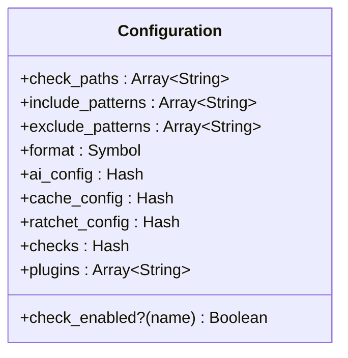
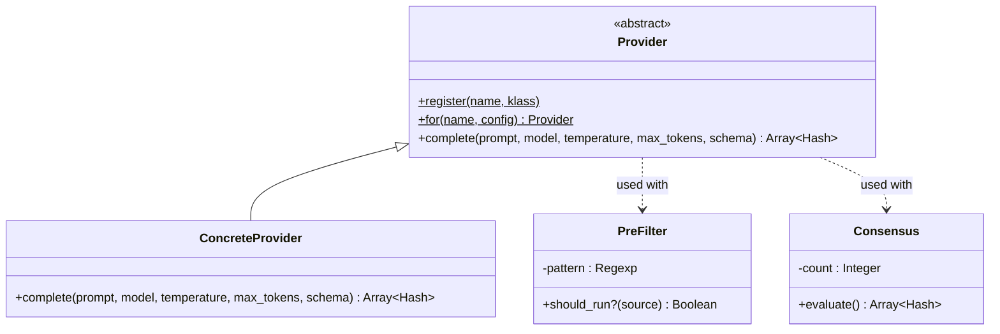
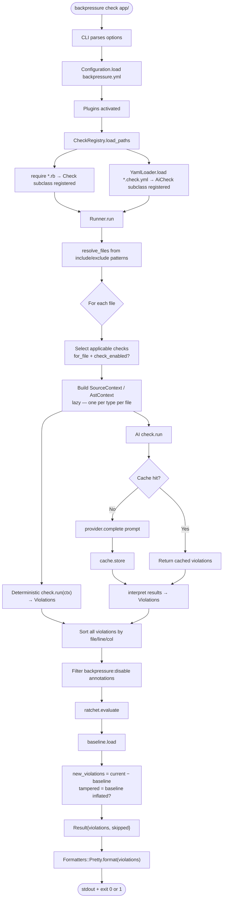
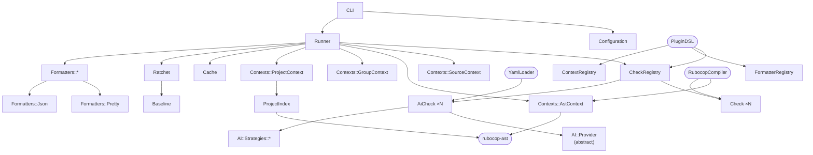

# Backpressure — Architecture

This document describes the internal architecture of the Backpressure gem: its layers, data flow, design patterns, and extension points.

---

## Table of Contents

- [Goals and Non-Goals](#goals-and-non-goals)
- [High-Level Architecture](#high-level-architecture)
- [Core Components](#core-components)
  - [Configuration](#configuration)
  - [CheckRegistry](#checkregistry)
  - [Runner](#runner)
  - [Check and AiCheck](#check-and-aicheck)
  - [Contexts](#contexts)
  - [Violation](#violation)
  - [Correction](#correction)
  - [Baseline and Ratchet](#baseline-and-ratchet)
  - [Cache](#cache)
  - [ProjectIndex](#projectindex)
  - [Formatters](#formatters)
  - [AI Layer](#ai-layer)
  - [YamlLoader](#yamlloader)
  - [RubocopCompiler](#rubocopcompiler)
  - [Plugin System](#plugin-system)
  - [CLI](#cli)
- [Data Flow: A Full Run](#data-flow-a-full-run)
- [Design Patterns](#design-patterns)
- [Dependency Graph](#dependency-graph)
- [Extension Points Summary](#extension-points-summary)
- [Relationship to External Tools](#relationship-to-external-tools)
- [Key Architectural Decisions](#key-architectural-decisions)

---

## Goals and Non-Goals

### Goals

- Provide a **unified check DSL** that covers deterministic AST-based rules, multi-file invariants, and AI-powered semantic checks through a single authoring interface.
- Enable **incremental adoption** on existing codebases via a ratcheting baseline; teams can enable new checks without blocking CI on pre-existing violations.
- Be **composable and extensible**: new check types, context shapes, formatters, AI providers, and strategies can be added via a plugin API without touching core.
- Stay **cheap by default**: deterministic checks have zero marginal cost; AI checks use caching and pre-filter strategies to minimise LLM calls.
- Produce **actionable output**: every violation points to a line and offers either a deterministic correction or an AI-suggested fix.

### Non-Goals

- Replace RuboCop for style enforcement. Backpressure targets architectural invariants, cross-file rules, and semantic quality that rule-based linters cannot express.
- Be a general-purpose test runner or CI orchestrator.
- Own language parsing; it delegates to `rubocop-ast` for Ruby AST work.

---

## High-Level Architecture



---

## Core Components

### Configuration

**`Backpressure::Configuration`**

Loads settings from `backpressure.yml` (or a hash) and exposes them as typed attributes. It is a singleton held on the `Backpressure` module.

Responsibilities:
- Parse and validate `backpressure.yml`.
- Provide `check_enabled?(name)` for per-check overrides.
- Expose `ai_config`, `cache_config`, `ratchet_config`, `include_patterns`, `exclude_patterns`.



### CheckRegistry

**`Backpressure::CheckRegistry`**

Global registry of all `Check` subclasses. Populated at require time (Ruby classes self-register) and via `YamlLoader` / plugin `checks_from`.

Key methods:
- `register(check_class)` — adds a class.
- `all` — all registered classes.
- `for_file(path)` — checks whose `files` glob matches the path.
- `by_name(name)` — look up by string name.
- `by_category(sym)` — look up by category.

Loading check files:

```
CheckRegistry.load_path(dir)
  → Dir.glob("#{dir}/**/*.rb").each { require }
  → Dir.glob("#{dir}/**/*.check.yml").each { YamlLoader.load }
```

### Runner

**`Backpressure::Runner`**

The execution engine. A `Runner` instance holds a reference to the `Configuration` and orchestrates a complete analysis pass.

`run` algorithm:

```
1. Resolve files from include/exclude globs
2. Load checks from check_paths
3. For each file:
   a. Select applicable checks (for_file + check_enabled?)
   b. Group checks by required context type
   c. Build context (lazy, one per context type per file)
   d. For each check:
      i.  Instantiate check
      ii. check.run(context)
      iii.Filter violations on lines with backpressure:disable annotation
      iv. Collect remaining violations
4. Sort all violations by file / line / column
5. Evaluate ratchet (if baseline present)
6. Format and output
7. Return Result{violations:, skipped:}
```

`Result` struct:

```ruby
Result = Struct.new(:violations, :skipped, keyword_init: true)
```

### Check and AiCheck

**`Backpressure::Check`** — base class for all deterministic rules.

Internal state per instance:
- `@violations` — Array<Violation>, populated during `#check(context)`
- `@skipped` — reason string, set by `#skip(reason)`

Instance lifecycle:
```
Runner instantiates check
  → check.run(context)
      → check.check(context)   ← subclass overrides this
      → return @violations
```

**`Backpressure::AiCheck`** — extends `Check` with an AI pipeline.

Class-level storage:
- `@@ai_settings` — inherited hash from `ai_config` DSL
- `@@prompt_text` — string from `prompt_template` DSL

`check(context)` flow:
```
1. Render prompt: prompt_text.gsub("{{source}}", context.source)
2. Resolve provider: AI::Provider.for(ai_settings[:provider], config: ...)
3. Check cache (if enabled): cache.fetch(...)
4. If cache miss: provider.complete(prompt:, model:, ...)
5. Store in cache
6. interpret(results, context) → violations
```

### Contexts

Contexts are value objects that encapsulate the data a check sees. They are built by the Runner on demand and reused across checks that require the same type for the same file.

```
SourceContext
  ├─ source: String
  ├─ file_path: String
  ├─ lines: Array<String>
  ├─ line_count: Integer
  └─ line(n): String          (1-based)

AstContext (wraps SourceContext)
  ├─ (all SourceContext attrs)
  ├─ ast: RuboCop::AST::Node  (lazy parsed)
  └─ processed_source: RuboCop::AST::ProcessedSource

GroupContext
  ├─ file_path: String        (primary role's path)
  ├─ source: String           (primary role's content)
  └─ group: Hash<Symbol, SourceContext|nil>

ProjectContext
  ├─ file_path: String
  ├─ source: String
  └─ project: ProjectIndex
```

Context resolution:

| `requires` value | Context class | When to use |
|---|---|---|
| `:source` | `SourceContext` | Text patterns, line-based rules |
| `:ast` | `AstContext` | Structural Ruby analysis |
| `:group` | `GroupContext` | Multi-file pair checking |
| `:project` | `ProjectContext` | Whole-codebase invariants |
| custom symbol | registered via plugin | Domain-specific data shapes |

### Violation

**`Backpressure::Violation`**

Immutable value object. Comparable (sorted by file → line → column). Carries an `identity` string used for baseline matching.

```ruby
Violation.new(
  check_name:     "NoDirectHttp",
  category:       :architecture,
  severity:       :error,
  message:        "Use HttpClient",
  file:           "app/services/webhook.rb",
  line:           14,
  column:         0,
  auto_correctable: false,
  correction:     nil,
  source_node:    node
)
```

### Correction

**`Backpressure::Correction`** — abstract base.

Subclasses:

| Class | Operation | Key attributes |
|---|---|---|
| `Corrections::Replace` | Substitute substring on a line | `line`, `original`, `replacement` |
| `Corrections::Insert` | Insert text before/after a line | `line`, `text`, `position` |
| `Corrections::Remove` | Delete a line | `line` |

All implement `apply(source) → String`.

Corrections are attached to violations. The `fix` command (or `check --ai-fix`) applies them by collecting all corrections, sorting by line (descending, to avoid index drift), and applying each in turn.

### Baseline and Ratchet

**`Backpressure::Baseline`**

Persists a snapshot of known violations to YAML.

```yaml
NoDirectHttp:
  count: 3
  files:
    - app/services/webhook.rb:14
    - app/controllers/api.rb:22
```

`identity` of a violation is a compound key (`check_name + file + line`) used to detect whether a violation is genuinely new or already in the baseline.

**`Backpressure::Ratchet`**

Wraps `Baseline` with enforcement logic:

```
ratchet.evaluate(current_violations)
  → load baseline
  → new_violations = violations.select { not in baseline }
  → tampered = baseline has checks with count > current count
  → Result{new_violations:, tampered:}
```

`anti_tamper: true` prevents teams from manually inflating the baseline to hide regressions.

### Cache

**`Backpressure::Cache`**

Content-addressed disk cache for AI check results.

Cache key: `SHA-256(check_version + ":" + file_path + ":" + file_content)`

Storage: `{dir}/{check_name}/{key}.json`

```
Cache.fetch(check_name:, file_path:, file_content:, check_version:)
  → key = sha256(check_version + file_path + file_content)
  → path = "#{dir}/#{check_name}/#{key}.json"
  → File.exist?(path) ? JSON.parse(File.read(path)) : nil

Cache.store(...)
  → FileUtils.mkdir_p(dir)
  → File.write(path, JSON.dump(result))
```

Cache invalidation is implicit: any change to the file content, check version, or prompt text produces a different key.

### ProjectIndex

**`Backpressure::ProjectIndex`**

Parses Ruby files and builds an in-memory catalog of class definitions and cross-references.

```
ProjectIndex.build(file_paths)
  → for each file: parse AST, collect :class nodes
  → store ClassEntry{name:, file:, node:, superclass_name:}
  → index by name and file

API:
  .classes                      → Array<ClassEntry>
  .classes_in(glob)            → Array<ClassEntry>
  .classes_matching(regex)     → Array<ClassEntry>
  .references_to(class_names)  → Array<{file:, node:, target:}>
```

`ProjectContext` exposes a shared `ProjectIndex` built once per runner invocation, not once per file.

### Formatters

**`Backpressure::Formatters::Base`**

Interface: `format(violations) → String`.

| Class | Output |
|---|---|
| `Formatters::Pretty` | ANSI-coloured human-readable text |
| `Formatters::Json` | Pretty-printed JSON array |

Severity → colour mapping (Pretty):

| Severity | ANSI colour |
|---|---|
| `:error` | Red |
| `:warning` | Yellow |
| `:info` | Cyan |

Formatters are resolved by name (`:pretty`, `:json`) from the formatter registry. Plugins can add new entries.

### AI Layer



Strategy composition is manual: check authors call strategies inside their `check` method. The YAML loader wires strategies from the `ai.strategy` key.

### YamlLoader

**`Backpressure::YamlLoader`**

Translates `.check.yml` files into anonymous `AiCheck` subclasses at load time.

```
YamlLoader.load(path)
  → YAML.safe_load(File.read(path))
  → klass = Class.new(AiCheck)
  → apply DSL: category, severity, files, requires, ai_config, prompt_template
  → Object.const_set(data["name"], klass)
  → CheckRegistry.register(klass)
  → klass

YamlLoader.load_all(dir)
  → Dir.glob("#{dir}/**/*.check.yml").map { load(path) }
```

### RubocopCompiler

**`Backpressure::Compiler::RubocopCompiler`**

Generates a `RuboCop::Cop::Base` subclass from a Backpressure check. Only checks that are both `compilable?` and `requires :ast` are eligible.

Generated cop lifecycle:
```
on_new_investigation
  → ctx = AstContext.new(source: processed_source.buffer.source,
                          file_path: processed_source.path)
  → check = CheckClass.new
  → check.run(ctx)
  → check.violations.each do |v|
       node = find_node_at_line(processed_source.ast, v.line)
       add_offense(node, message: v.message)
     end
```

The output file is written to `--output-dir` and named `{snake_case_name}.rb`.

### Plugin System

**`Backpressure::PluginDSL`**

Evaluated inside the block passed to `Backpressure.register_plugin`:

```ruby
Backpressure.register_plugin(:name) do
  checks_from "path/to/checks"
  formatter :name, FormatterClass
  context :name do |source:, file_path:|
    MyContext.new(source: source, file_path: file_path)
  end
end
```

DSL methods:

| Method | Effect |
|---|---|
| `checks_from(dir)` | `CheckRegistry.load_path(dir)` |
| `formatter(name, klass)` | `FormatterRegistry.register(name, klass)` |
| `context(name, &block)` | `ContextRegistry.register(name, block)` |

Plugins are activated by listing their name/require path in `backpressure.yml` under `plugins:`. The CLI `require`s each plugin string before running.

### CLI

**`Backpressure::CLI`**

Thin wrapper over `OptionParser`. Commands:

```
CLI.start(argv)
  → parse global options (--config, --format)
  → load configuration
  → load plugins
  → dispatch command:
      check → Runner.new.run + Ratchet.evaluate + format + exit code
      list  → CheckRegistry.all → pretty print
      init  → write default backpressure.yml
      fix   → (planned)
      cache → (planned)
      compile → RubocopCompiler.new.compile each compilable check
```

Exit codes:
- `0` — no new violations (or all violations within baseline)
- `1` — new violations detected, or ratchet tamper detected

---

## Data Flow: A Full Run



---

## Design Patterns

| Pattern | Where used | Purpose |
|---|---|---|
| **Template Method** | `Check#check` | Subclasses override the algorithm step |
| **Strategy** | `AI::Strategies::*` | Swap accuracy/cost trade-offs per check |
| **Registry** | `CheckRegistry`, `FormatterRegistry`, `ContextRegistry` | Decouple discovery from usage |
| **Builder / Factory** | `YamlLoader` | Construct classes from data at runtime |
| **Value Object** | `Violation`, `Correction` | Immutable, comparable, identity-carrying |
| **Visitor** | AST traversal via `each_node` | Decouple node logic from tree shape |
| **Plugin DSL** | `PluginDSL` | Miniature internal language for extension |
| **Adapter** | `RubocopCompiler` | Bridge Backpressure checks into RuboCop's API |
| **Null Object** | `GroupContext#group[role]` returns `nil` | Avoid nil checks in check code |

---

## Dependency Graph



External dependencies:
- `rubocop-ast` — Ruby AST parsing (required for `:ast` context and `RubocopCompiler`)
- `parser` — pulled in transitively by `rubocop-ast`
- AI provider gems — loaded only when the corresponding provider is configured

---

## Extension Points Summary

| Extension Point | How to add | Consumed by |
|---|---|---|
| Deterministic check | Subclass `Check`, place in `check_paths` | `CheckRegistry` → `Runner` |
| AI check (Ruby) | Subclass `AiCheck`, place in `check_paths` | `CheckRegistry` → `Runner` |
| AI check (YAML) | Write `.check.yml`, place in `check_paths` | `YamlLoader` → `CheckRegistry` |
| Context type | `context :name { }` in plugin | `Runner` (context resolution) |
| Formatter | Subclass `Formatters::Base`, register via plugin | `CLI` / `Runner` |
| AI provider | Subclass `AI::Provider`, call `Provider.register` | `AiCheck#check` |
| AI strategy | Any class with `evaluate` or `should_run?` | Check authors call directly |
| Correction type | Subclass `Correction`, implement `apply` | `fix` command |
| Plugin | `Backpressure.register_plugin(:name) { }` | `CLI` startup |
| Project indexer | Extend `ProjectIndex` | `ProjectContext` |

---

## Relationship to External Tools

| Tool | Relationship |
|---|---|
| **RuboCop** | Backpressure uses `rubocop-ast` for parsing; the `RubocopCompiler` generates native RuboCop cops from compilable checks |
| **Component linters** | Backpressure provides a `:group` and custom context mechanism that supports component-tree analysis equivalent to dedicated component linters, without requiring a separate tool |
| **CI systems** | Backpressure exits non-zero on new violations; JSON output feeds dashboards or PR annotations |
| **LLM APIs** | Accessed via the `AI::Provider` abstraction; no provider is required for deterministic checks |

---

## Key Architectural Decisions

### 1. Unified Check DSL

All check families (deterministic, YAML-declared AI, Ruby AI) share the same `Check` base class. The Runner sees only `Check` instances regardless of implementation. This prevents tool fragmentation and keeps the registry simple.

**Trade-off:** `AiCheck` carries AI plumbing in the base class, adding weight to checks that never use it. This is acceptable because AI checks are identified by class hierarchy, not flag.

### 2. Context injection, not inheritance

A check declares what data it needs (`requires :ast`) rather than inheriting from a context-specific base class. The Runner builds and injects the right context. This means a check can switch context type without changing its class hierarchy.

**Trade-off:** The `requires` declaration is a convention; incorrect declarations cause runtime errors rather than compile-time errors.

### 3. Ratcheting from day one

Every project starts with an empty baseline. Any check can be adopted on a legacy codebase without a big-bang cleanup by running `--update-baseline` first. Violation reduction is voluntary and gradual.

**Trade-off:** Baseline files must be committed and kept in sync. Stale baselines hide real violations.

### 4. Content-hash cache for AI checks

Cache keys include the file content hash, so any change to the file invalidates the cache entry for that file. There is no TTL; entries persist until explicitly cleared or the cache directory is deleted.

**Trade-off:** Long-running projects accumulate large cache directories. The `cache stats` / `cache clear` commands manage this.

### 5. Minimal required dependencies

Only `rubocop-ast` is a hard dependency. AI provider libraries, GraphQL parsers, and similar domain-specific gems are optional and loaded only when used. This keeps `bundle install` fast for projects that only use deterministic checks.

### 6. Plugin DSL over inheritance

Plugins use a declarative mini-DSL (`checks_from`, `formatter`, `context`) rather than requiring subclassing or monkey-patching. This keeps the plugin API small and forwards-compatible.

### 7. Manual AI strategy composition

Strategies (consensus, pre-filter) are not wired automatically by the Runner; check authors compose them explicitly. This gives maximum flexibility at the cost of requiring each check author to understand the strategy API.

Future direction: the YAML loader (`strategy:` key) hides this complexity for YAML checks.
